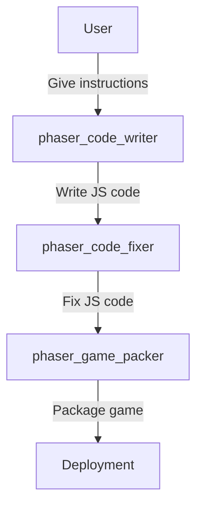

# Phaser Crew Naive

A naive implementation of an LLM agent workflow for creating Phaser games. 

## Usage

1. Set up a working folder for the new game, such as `working_game`.

2. Set the terminal to the working folder, using the command:
   ```bash
   cd working_game
   ```

3. Run the following command to create a new Phaser game:
   ```bash
   techies --allow-load-scripts run phaser_crew "player can revert gravity direction"
   ```
   where you can alter the description of the game.

4. The game will be created in the `working_game` folder, to test it, run:
   ```bash
   python host_test.py
   ```


## Current Framework

It is an LLM agent workflow designed using the following principles:
- **Lazy prompting but detailed examples**: The agent is not given a detailed prompt but is provided with a set of example JS code files. Because we expect examples provides more concrete information than a prompt. 
- **Minimal but strong agents**: The flow uses a minimal number of strong agents without back-and-forth communication, rather than a swarm of weaker agents. Because we expect stronger agents can better coordinate multiple goals on their own.

The workflow is as follows:


`phaser_code_writer` reads the user instructions and example JS code, generating a new JS code file. 

`phaser_code_fixer` reads the code and refines it, ensuring it is complete and functional.

The above two agents may call `phaser_code_saver` to save the code in the working folder.

`phaser_game_packer` configures the html file and assets for the game, copying them to the working folder. 

## Roadmap
Short term (all require tool argument issues get fixed):
- Fix the icon and splash screen generation capability.
- Enable asset browsering.

Long term:
- Add more example JS code files.
- Enable a simple retrieval on the example JS code files.
- Retrieve official Phaser docs and examples.
